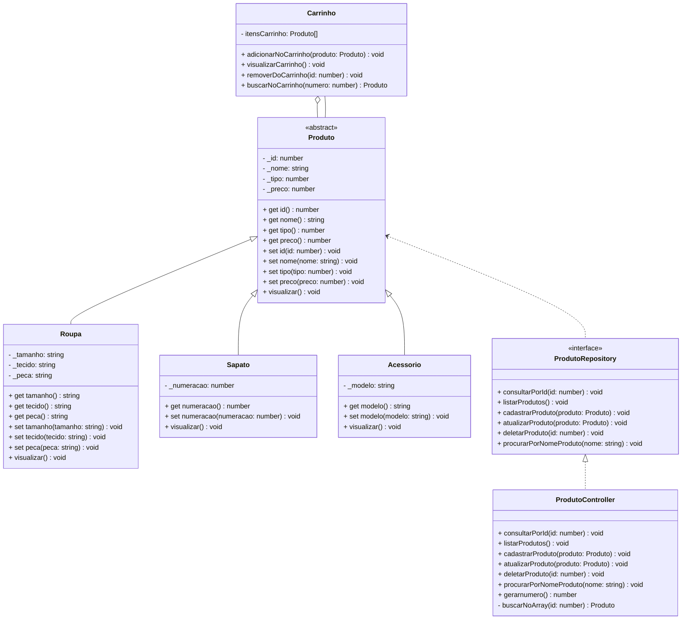

# 🛍️ Projeto Final Bloco 01 - TypeScript & POO

## Simulador de Ecommerce Varejo Feminino | Portfólio Profissional

<br />

<div align="center">
	
</div>
<br />

<div align="center">
  
  
  
  
  
  
  
</div>


------

<br />


O **Projeto Ecommerce Feminino** é um projeto **educacional** desenvolvido em **TypeScript**, com foco em **Programação Orientada a Objetos (POO)** e **arquitetura modular**, simulando gerenciamento dos produtos por meio de um **CRUD para Vestimentas, Calçados e Acessórios**.

**Objetivo:** Demonstrar **organização, domínio técnico, modelagem de domínio e boas práticas de engenharia de software** em um case prático de portfólio.

<br />

> [!WARNING]
>
> Este projeto possui **fins educacionais** e **não representa um sistema de ecommerce  real**. Foi desenvolvido para **aprendizado, demonstração técnica e portfólio profissional**.

<br />

Este projeto foi estruturado para:

- Demonstrar **competência técnica em TypeScript**
- Aplicar **POO em um cenário realista**
- Evidenciar **arquitetura limpa e organização de código**
- Simular **regras de negócio do varejo online **
- Servir como **case técnico para recrutadores**

<br />

## Competências Técnicas Demonstradas

- Programação Orientada a Objetos (Encapsulamento, Herança, Polimorfismo)
- Modelagem de domínio orientada a objetos
- Arquitetura em camadas (**Model, Repository, Controller**)
- Tipagem forte com **TypeScript**
- Separação de responsabilidades
- Boas práticas de código e organização modular
- Validação de entradas e controle de fluxo
- Estrutura pronta para evolução futura (API, DB, testes)

<br />

## Impacto Técnico e Métricas

| Indicador                     | Valor                         |
| ----------------------------- | ----------------------------- |
| Linhas de código              | +700                          |
| Classes principais            | 7                             |
| Funcionalidades implementadas | 10                             |
| Conceitos POO aplicados       | 6+                            |
| Camadas arquiteturais         | Model, Repository, Controller |
| Persistência                  | Simulada em memória           |
| Complexidade lógica           | Média                         |
| Uso educacional               | ✅                             |

<br />

## Funcionalidades do Projeto


## Funcionalidades do Projeto

| Funcionalidade                                               | Status |
| ------------------------------------------------------------ | ------ |
| CRUD de Produtos (Roupas, Sapatos e Acessórios)              | ✅     |
| Listagem de todos os produtos cadastrados                    | ✅     |
| Consulta de produto por ID                                   | ✅     |
| Consulta de produto por nome                                 | ✅     |
| Atualização dos dados de cada produto                        | ✅     |
| Exclusão de produtos                                         | ✅     |
| Visualização detalhada dos produtos (polimorfismo)           | ✅     |
| Interface CLI interativa                                     | ✅     |
| Gerenciamento de Carrinho de Compras                         | ✅     |

<br />


<br />

## Diagrama de Classes



<br />

## Arquitetura do Projeto

Estrutura organizada para facilitar **manutenção, escalabilidade e leitura técnica**:

```text
📦 projeto_final_bloco_01
 ┣ 📂 src
 ┃ ┣ 📂 controller     # Lógica da aplicação
 ┃ ┣ 📂 model          # Entidades (Produto, Roupa, Sapato, Acessorio, 	Carrinho)
 ┃ ┣ 📂 repository     #Interface de persistência (ProdutoRepository)
 ┃ ┗ 📂 util           # Utilidades (Input, Colors, etc.)
 ┣ 📜 Menu.ts          # Classe principal com menu interativo (CLI)
 ┗ 📜 tsconfig.json
 
```

<br />

## Tecnologias Utilizadas

- **Linguagem & Runtime**

  - TypeScript

  - Node.js

  - ts-node

- **Ferramentas & Qualidade**
  - Git & GitHub
  - Mermaid (diagramas UML)
  - CLI interativa (terminal)

<br />

## Como Executar

**1️⃣ Clone o repositório**

```bash
git clone https://github.com/Jeaninny/projeto_final_bloco_01
```

**2️⃣ Acesse a pasta do projeto via terminal**

```bash
cd projeto_final_bloco_01
```

**3️⃣ Instale as dependências**

```bash
npm install
```
Caso o ts-node não esteja disponível na máquina, instale-o com 
```bash
npm install ts-node
```

**4️⃣ Execute a aplicação**

```bash
ts-node Menu.ts
```
**📌 Dependências utilizadas**

```bash
readline-sync
@types/readline-sync
@types/node
iconv-lite
typescript
ts-node
```
<br />

## Implementações Futuras

- [ ]  Persistência com banco de dados
- [ ]  Testes automatizados (Jest)
- [ ]  API REST com NestJS
- [ ]  Interface Web (React)
- [ ]  Dockerização
- [ ]  CI/CD com GitHub Actions

<br />

## Contribuições


Sugestões, melhorias e pull requests são bem-vindos.

Você pode contribuir com:

- Melhorias arquiteturais
- Refatorações
- Testes automatizados
- Documentação

<br />

## Licença


Este projeto está sob licença **MIT** — livre para uso educacional e profissional.

<br />

##  Autora

**Jeaninny Teixeira - Desenvolvedora FullStack**

🔗 **GitHub:** https://github.com/Jeaninny

🔗 **LinkedIn:** https://www.linkedin.com/in/jeaninnyteixeira/

Projeto desenvolvido para **aprendizado contínuo**, **demonstração técnica** e **portfólio profissional**.